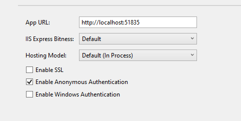
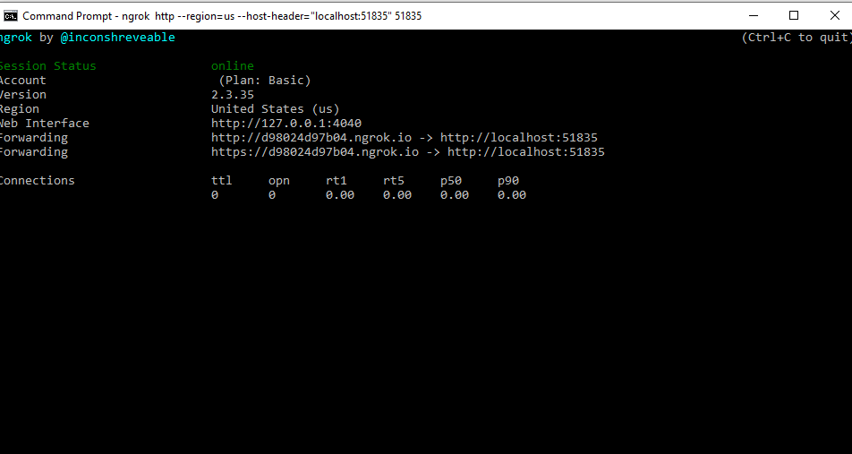

# How to Receive an SMS Message with ASP.NET Core MVC and SignalR


This project demonstrates how to go about receiving SMS messages from the Vonage Messaging API using ASP.NET Core MVC and SignalR. With this project you'll be able to launch the supplied app, configure your Vonage API Webhooks, and receive SMS messages in real time directly into your browser.

## Welcome to Vonage

<!-- change "github-repo" at the end of the link to be the name of your repo, this helps us understand which projects are driving signups so we can do more stuff that developers love -->

If you're new to Vonage, you can [sign up for a Vonage API account](https://dashboard.nexmo.com/sign-up?utm_source=DEV_REL&utm_medium=github&utm_campaign=githubreceive-sms-aspnet-core-signalr) and get some free credit to get you started.

## Prerequesites

* You'll need a Vonage API account. You can [sign up here](https://dashboard.nexmo.com/sign-up)
* You'll need the latest version of the [.NET Core 3.1 SDK](https://dotnet.microsoft.com/download/dotnet-core/3.1)
* Optional - I used [Ngrok](https://developer.nexmo.com/tools/ngrok) to test this demo

## Testing

We're going to going to test this with [Ngrok](https://developer.nexmo.com/tools/ngrok) to test this demo. Ngrok allows us to build a publicly accessible tunnel to our app, which is very useful when we need to expose publicly accessible http endpoints to our apps. If you are going to be testing this with IIS Express like I am, you will want to check out our [explainer on the subject](https://developer.nexmo.com/tools/ngrok#usage-with-iis-express) as there are special considerations. What this boils down to is that we need to add a `--host-header` option when we are starting up ngrok.



### Start Ngrok

Next we'll start up ngrok. We'll point incoming requests to the port from our app url, and we will have the host and port replace the incoming host header. This can all be done by running the following command (replace the port number with your port).

```sh
ngrok http --region=us --host-header="localhost:51835" 51835
```

This command will result in your terminal being taken over by ngrok, it will show you a url that all requests will be forwarded from, this will be of the form `http://randomhash.ngrok.io` my random hash came up `d98024d97b04` so for the remainder of this explainer just replace that value with whatever value came up for yours.



After starting up my app in IIS Express, I can navigate to my ngrok url to ensure that it's publicily accessible.

### Configure Webhooks

The route to the SMS controller in the case of the above is: `http://d98024d97b04.ngrok.io/webhooks/inbound-sms` adjust the hash for whatever your hash is. The last thing needed before testing is to tell the Vonage SMS API where to send the messages (the URL just mentioned).

To do this, navigate to https://dashboard.nexmo.com/settings. Under Default SMS Settings, set the Inbound Messages field to the that url, and change the HTTP Method to `POST-JSON`. Click Save Changes and we're ready to test. Navigate to your home page and go ahead and send your Vonage API Virtual number a test message. If you're not certain what your Vonage Virtual Number is, you can find it in [your dashboard under numbers](https://dashboard.nexmo.com/your-numbers).

## Getting Help

We love to hear from you so if you have questions, comments or find a bug in the project, let us know! You can either:

* Open an issue on this repository
* Tweet at us! We're [@VonageDev on Twitter](https://twitter.com/VonageDev)
* Or [join the Vonage Community Slack](https://developer.nexmo.com/community/slack)

## Further Reading

* Check out the Developer Documentation at <https://developer.nexmo.com>

<!-- add links to the api reference, other documentation, related blog posts, whatever someone who has read this far might find interesting :) -->


